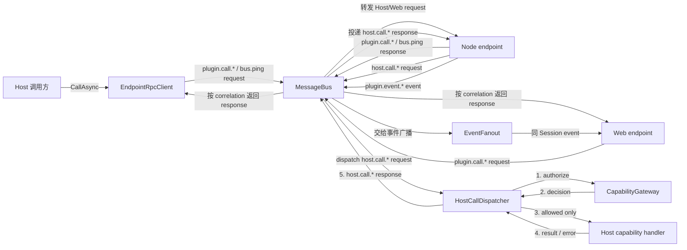
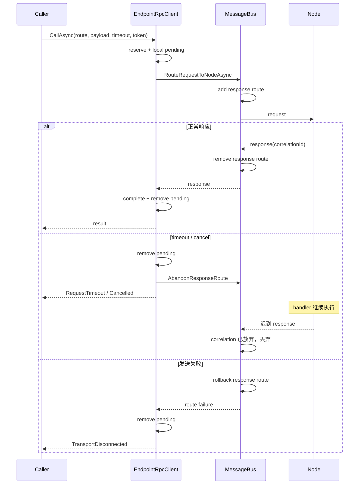

# MessageBus 职责收敛与 EndpointRpcClient 设计

> 状态：设计稿。该改造是 [Node Plugin 心跳生命周期重构](node-plugin-heartbeat-design.md) 的前置工作。

## 1. 结论

先收敛 `MessageBus`，再迁移心跳。目标边界：

```text
MessageBus          → endpoint 与 response route
EndpointRpcClient   → 调用方 pending、超时、取消、背压
HostCallDispatcher  → 能力校验、Host handler 执行与响应
EventFanout         → 事件队列、广播和丢弃策略
```

`MessageBus` 不再持有 `TaskCompletionSource`、调用 timeout、业务 handler 或 capability policy。由于当前 Envelope 没有目标 endpoint，Bus 仍需保留轻量的 `requestId → originEndpoint` 映射来路由响应。

## 2. 当前问题

当前 `MessageBus` 同时承担：

- endpoint 注册、身份覆盖和 Session 隔离；
- request/response correlation；
- 每 endpoint pending 上限；
- Node → Host capability 校验与 handler 调用；
- Host handler timeout；
- 业务错误响应构造；
- 调用耗时和结果诊断；
- 事件广播、队列和丢弃策略；
- Session 断开时构造失败响应。

同时 `NodePluginBusHost` 和 Node SDK 又分别维护 pending 与 timeout，导致同一个调用存在多层状态和多条清理路径。

主要风险：

1. 发送异常、取消和 Session 切换时容易只清理其中一层 pending。
2. Bus 修改会影响路由、业务调用、权限、超时、诊断和背压，回归面过大。
3. 心跳若直接复用当前 Bus，需要再次实现 TCS、timeout 和 correlation 清理。
4. HostCall 的执行策略与基础路由耦合，无法独立测试和替换。

## 3. 目标职责

### `MessageBus`

保留：

- endpoint 注册、注销和 transport 订阅；
- 根据 transport binding 覆盖入站身份；
- Envelope 与 route 基础校验；
- Session/插件隔离；
- request 到 Node endpoint 的转发；
- 最小 response route 表；
- 直接向指定 endpoint 投递响应；
- 将事件交给 `EventFanout`；
- 未知 correlation、非法路由和投递失败的基础诊断。

移除：

- 调用方 `TaskCompletionSource`；
- timeout timer 和 `CancellationTokenSource`；
- HostCall handler 注册与执行；
- capability 业务策略；
- 业务调用成功、失败、超时的统计；
- Session 断开时为每个调用合成失败响应。

### `EndpointRpcClient`

每个 Host endpoint 一个实例，负责：

- 生成请求 ID；
- 本地 pending 和 `TaskCompletionSource`；
- 调用方本地 timeout 与用户取消；
- 最大并发调用数；
- response/error 解析；
- timeout/cancel/send failure 后放弃 Bus response route；
- endpoint 或 Session 失效时失败化全部 pending；
- 调用级诊断。

业务 `host` 和心跳 `host-control` 使用不同实例。

### `HostCallDispatcher`

负责 Node → Host 调用：

- 拒绝 WebView 直接调用 `host.call.*`；
- `CapabilityGateway` 授权；
- 查找插件 HostCall handler；
- 使用 Session/Application 生命周期 token 调用 handler；
- 将 handler 结果或异常转换为 response；
- HostCall 服务端诊断。

它不根据调用方的 `timeoutMs` 取消 handler。调用方超时后，handler 可以继续执行并产生副作用；最终 response 若已无人等待则被丢弃。

### `EventFanout`

负责：

- 同 Session 广播；
- 排除来源 endpoint；
- bounded queue、丢弃策略和投递延迟诊断。

第一阶段允许它继续作为 Bus 的内部协作者，但队列实现不再直接堆在 `MessageBus` 中。

## 4. 目标结构



`HostCallDispatcher` 是编排者：必须先调用 `CapabilityGateway` 取得授权结果；只有 `decision.IsAllowed` 时才调用 capability handler。拒绝时跳过 handler，直接构造错误响应。`CapabilityGateway` 只负责授权判断，不负责转发或执行 handler。

主要消息方向：

| 来源 | 经过 MessageBus 的消息 | 目标 |
|---|---|---|
| Host `EndpointRpcClient` | `plugin.call.*`、`bus.ping` request | Node |
| Web endpoint | `plugin.call.*` request | Node |
| Node | 上述 request 的 response | 原 Host/Web endpoint |
| Node | `host.call.*` request | `HostCallDispatcher` |
| `HostCallDispatcher` | `host.call.*` response | 原 Node Session |
| Node | `plugin.event.*` event | 同 Session Web endpoints |
| Host | `host.event.*` event | 指定 Session endpoints |

Node Named Pipe 的 `bus.handshake` 不进入这里：它在 Node endpoint 注册到 MessageBus 之前由 `PipeHandshake` 单独完成。

## 5. MessageBus API

建议收敛为路由 API：

```csharp
public interface IMessageRouter
{
    void RegisterEndpoint(EndpointId endpoint, IMessageTransport transport);
    void UnregisterEndpoint(EndpointId endpoint);

    Task RouteRequestToNodeAsync(
        Envelope request,
        EndpointId origin,
        CancellationToken cancellationToken);

    bool AbandonResponseRoute(string requestId, EndpointId origin);

    Task SendToEndpointAsync(
        EndpointId target,
        Envelope envelope,
        CancellationToken cancellationToken);

    Task BroadcastAsync(
        EndpointId sessionEndpoint,
        Envelope envelope,
        string? excludeEndpointId,
        CancellationToken cancellationToken);
}
```

路由失败返回类型化异常或结果，例如 `EndpointUnavailable`、`DuplicateRequestId` 和 `TransportDisconnected`；Bus 不构造面向业务调用者的超时文本。

## 6. Response route 表

当前响应不携带可信的目标 endpoint，因此保留：

```csharp
private sealed record ResponseRoute(
    EndpointId Origin,
    string Route);
```

映射关系：

```text
request.Id → ResponseRoute(originEndpoint, route)
```

它不是 RPC pending：

- 不含 TCS；
- 不含 timeout；
- 不含 cancellation；
- 不记录业务结果；
- 只决定 response 投递到哪个 endpoint。

规则：

1. 转发请求前 `TryAdd`；重复 request ID 直接拒绝。
2. 向 Node 写入失败时立即移除。
3. response 到达时用 `TryRemove` 取得 origin 并投递。
4. RpcClient timeout/cancel 时调用 `AbandonResponseRoute`。
5. endpoint 注销时移除所有以它为 origin 的 route。
6. 未知或迟到 response 直接丢弃并记录基础诊断。

## 7. EndpointRpcClient

```csharp
internal interface IEndpointRpcClient : IAsyncDisposable
{
    EndpointId Endpoint { get; }

    Task<JsonNode?> CallAsync(
        string route,
        JsonNode? payload,
        TimeSpan timeout,
        CancellationToken cancellationToken);

    void FailPending(BusError error);
}
```

### 调用流程



### 竞态规则

- 本地 pending 必须先于 Bus 转发建立，避免快速响应先到。
- timeout 和 response 通过 `TryRemove` 竞争，只有获胜方完成调用。
- response 已从 Bus route 表取出但本地调用刚超时时，RpcClient 忽略该迟到响应。
- 所有路径都在 `finally` 或单一 completion helper 中释放并发名额。
- Dispose/`FailPending` 必须幂等。

## 8. Caller timeout only

统一采用 `caller timeout only` 语义：

```text
EndpointRpcClient
  → Host 调 Node 时，决定 Host 最多等待多久

Node SDK RpcClient
  → Node 调 Host 时，决定 Node 最多等待多久

MessageBus
  → 原样路由，不启动 timer，不发送远端取消

HostCallDispatcher / Node HandlerRouter
  → handler 继续执行，不因调用方 timeout 自动取消
```

调用方 timeout 或用户取消后：

1. 本地调用完成为 `RequestTimeout` 或 `Cancelled`；
2. 删除本地 pending；
3. 放弃 Bus response route；
4. 不发送 `bus.cancel`；
5. 远端 handler 继续运行；
6. handler 以后返回的迟到 response 被安全丢弃。

语义约束：

```text
调用超时 ≠ 远端执行失败
调用超时 ≠ 远端执行取消
```

非幂等操作超时后不得盲目重试；需要重试的写操作应使用 operation ID 或幂等键。handler 只接受 Session 停止、应用退出等生命周期 cancellation，以及 capability 自己定义的资源超时。

## 9. 背压

Host 发起的 RPC 并发上限移到 `EndpointRpcClient`。心跳使用独立 `host-control` RpcClient，因此不受业务 `host` pending 占满影响。

接收方 handler 的并发名额必须在 handler 真正完成后释放，不能在调用方 timeout 时提前释放。否则大量已超时但仍运行的 handler 会绕过并发上限。长时间不返回的 handler 通过并发上限和诊断暴露，不由 MessageBus 强制终止。

WebView 和 Node 属于外部 endpoint，不能只信任客户端自限流。它们的入站请求仍需 Host 侧 admission guard。该 guard 应作为 endpoint binding 的独立策略，而不是 RPC timeout：

```text
EndpointBinding
  ├── transport identity
  ├── request admission quota
  └── MessageBus routing
```

第一阶段可复用 `PendingRequestTracker`，但由 binding/route record 的建立与释放驱动；不得重新引入 TCS 或 timer。

## 10. HostCallDispatcher

从 `MessageBus` 移出：

```text
RegisterHostCallHandler
UnregisterHostCallHandler
RejectWebHostCallAsync
DispatchHostCallAsync
BuildHostCallReply
CapabilityGateway dependency
Host handler 执行和业务诊断
```

Bus 对 `host.call.*` 只做身份覆盖、route 校验，然后转交 dispatcher。Dispatcher 使用 Session/Application 生命周期 token 执行 handler，不创建 request timeout CTS；完成后通过 `SendToEndpointAsync(source, response)` 回复绑定的 Node endpoint。若旧 Session 已不存在，迟到结果直接丢弃。

## 11. Session 断开

当前 Bus 会遍历 correlation 并合成 `TransportDisconnected` response。目标流程改为：

```text
PluginSessionManager 检测 Session 失效
  → Session 进入 Restarting / Stopping
  → Session 所有 RpcClient.FailPending(TransportDisconnected)
  → Dispose / 注销 Host endpoints
  → MessageBus 清理该 Session 的 response routes
  → 注销 Node endpoint
```

Bus 只清理不可再投递的路由记录，不负责完成调用方 Task。调用方 Task 由拥有它的 RpcClient 完成。

WebView pending 由 Web SDK 自己超时；Session/WebView transport 关闭后不再接收迟到响应。

## 12. 诊断归属

| 诊断 | 所有者 |
|---|---|
| endpoint 注册、非法路由、未知 correlation | `MessageBus` |
| client pending、本地 timeout/cancel、调用耗时 | `EndpointRpcClient` |
| capability 拒绝、Host handler 耗时/异常 | `HostCallDispatcher` |
| 事件队列深度、丢弃、投递延迟 | `EventFanout` |
| Session 断开与重启 | `PluginSessionManager` |

迁移后应保持现有诊断指标语义；只改变记录位置，不静默删除指标。

## 13. 协议兼容

本设计不修改 v3 Envelope：

- `timeoutMs` 表示发送方声明的本地等待预算；接收方不得据此取消 handler；
- `correlationId` 继续关联 response；
- `endpointId` 继续表示发送方身份，不改成目标地址；
- 不新增 `targetEndpointId` 或 `replyTo`。

未来协议若增加可信目标 endpoint，可再移除 response route 表；本次不做协议升级。

## 14. 迁移步骤

### 阶段一：拆出服务端执行

1. 新增 `HostCallDispatcher`。
2. 迁移 capability、handler、错误映射和诊断；删除基于 `request.TimeoutMs` 的 handler CTS。
3. `MessageBus` 仅把 `host.call.*` 交给 dispatcher。
4. Host handler 只接收 Session/Application 生命周期 token。

### 阶段二：引入 RpcClient

1. 新增 `EndpointRpcClient` 和独立测试。
2. 将 `NodePluginBusHost` 的 `_pending`、timeout 和取消逻辑迁入 RpcClient。
3. Bus `_pending` 拆分为不含计时信息的 response route 表。
4. 发送失败时保证本地 pending 和 response route 同时回滚。

### 阶段三：断线与背压

1. Session teardown 改为通知 RpcClient 失败化 pending。
2. Bus 只清理 response route，不再合成业务失败响应。
3. Host 调用并发上限移入 RpcClient。
4. Web/Node 入站 quota 移入 endpoint binding admission guard。

### 阶段四：事件与心跳

1. 将 bounded event queue 抽为 `EventFanout`。
2. 按心跳设计创建 `host-control` RpcClient。
3. 迁移 `SessionHeartbeat`，删除 BusHost 旧心跳实现。

## 15. 测试要求

### MessageBus

1. 同 Session request 正确转发到 Node。
2. response 按 correlation 返回原 endpoint。
3. 跨插件、跨 Session 响应不能泄漏。
4. 重复 request ID 被拒绝且不覆盖旧 route。
5. 发送失败、abandon、endpoint 注销均清理 response route。
6. 未知或迟到 response 被丢弃。
7. Bus 不启动 timeout timer，也不持有调用 TCS。
8. 入站身份覆盖、EnvelopeValidator 和 RouteRules 生效。

### EndpointRpcClient

1. 正常响应只完成一次。
2. timeout、用户取消和发送失败返回正确错误。
3. response/timeout 竞态无双重完成和 pending 泄漏。
4. `FailPending` 与 Dispose 幂等。
5. pending 上限拒绝新调用，但不影响其他 endpoint 的 RpcClient。
6. Session 替换后旧客户端不能接收新 Session 响应。
7. 本地 timeout 后不发送远端取消，迟到 response 被丢弃。

### HostCallDispatcher

1. capability allow/deny 与现有行为一致。
2. WebView 直接 `host.call.*` 仍被拒绝。
3. 调用方 timeout 后 handler 继续执行，最终结果允许因 Session 不存在而丢弃。
4. Session/Application 关闭仍能取消支持生命周期 cancellation 的 handler。
5. handler 异常和响应映射正确。
6. Dispatcher 不创建基于 `request.TimeoutMs` 的 CTS。

### 集成测试

1. Host → Node → Host 完整调用链。
2. WebView → Node → WebView 完整调用链。
3. Node → HostCallDispatcher → Node 完整调用链。
4. Session 断开时所有 RpcClient pending 失败，Bus route 表归零。
5. 业务 RpcClient 达到 pending 上限时，独立 `host-control` RpcClient 仍可调用。

## 16. 验收标准

- `MessageBus` 不创建 timeout CTS，不等待业务 handler，不持有调用 TCS。
- `MessageBus` 只维护 endpoint、response route 和路由所需的轻量状态。
- 每个调用的 pending、本地 timeout 和本地取消只有一个所有者：调用方向的 RpcClient。
- `HostCallDispatcher` 只负责 capability、handler 执行和响应，不解释调用方 timeout。
- 调用方 timeout 不发送远端取消；远端 handler 可以完成，迟到 response 被安全丢弃。
- 非幂等调用不得因 `RequestTimeout` 自动重试。
- Session 断开后不存在本地 pending 或 response route 泄漏。
- 现有身份隔离、背压、事件丢弃和诊断能力不降低。
- 完成阶段一至三后，再开始心跳生命周期代码迁移。
