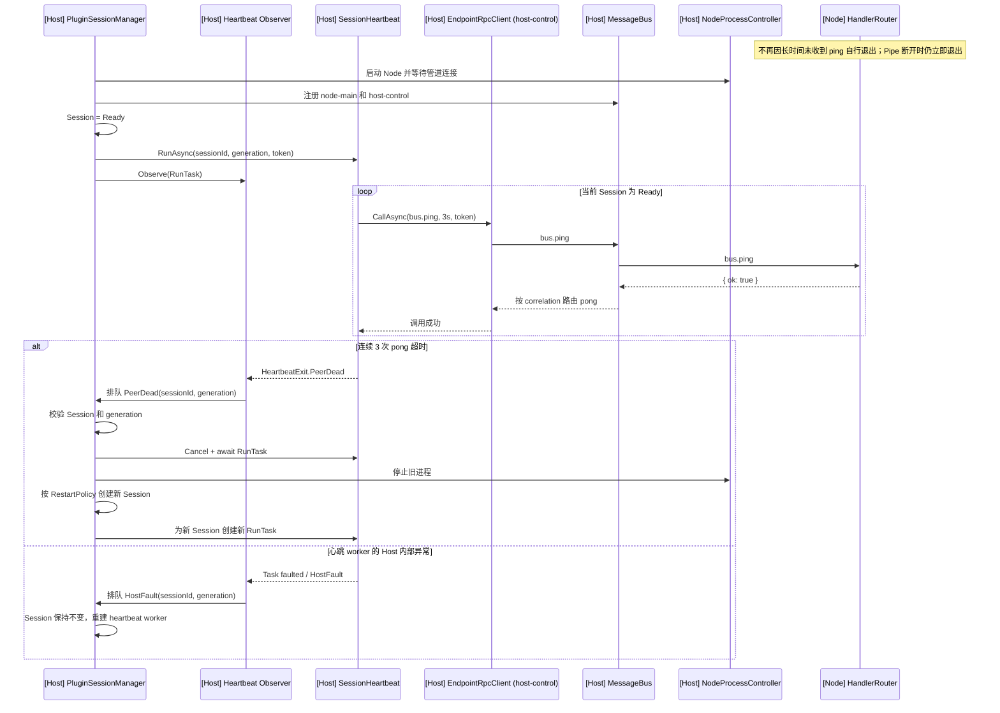

# Node Plugin 心跳生命周期重构设计

> 状态：已实施（2026-09-18）。依赖的 [MessageBus 职责收敛与 EndpointRpcClient 设计](message-bus-responsibility-refactor-design.md) 阶段一至三已完成；实现未改变 `bus.ping` 协议和既有自动重启策略。

## 1. 当前问题

心跳目前由 `NodePluginBusHost.EnsureStartedAsync()` fire-and-forget 启动，但 Session 由 `PluginSessionManager` 创建和替换。两者生命周期分离：

- `_started == 1` 只说明曾启动成功，不能证明心跳任务仍在运行。
- 断线时若 ping 正在等待响应，心跳收到 `TransportDisconnected` 后会退出；`SessionReplaced` 不会启动新心跳。
- 若旧心跳没有退出，它会读取可变的 `_session`，继续服务新 Session，并复用旧 `HeartbeatMonitor` 的计数。
- 心跳任务没有保存和监管，意外退出后只能记录日志，无法恢复。
- Node SDK 以 15 秒未收到 ping 判定 Host 丢失；电脑睡眠、休眠或调试暂停后可能误杀所有 Node 插件。

根因是：**Session 的所有者和心跳的所有者不是同一个组件。**

## 2. 目标与约束

必须满足：

```text
一个 Session     → 最多一个心跳实例
一个心跳实例     → 只服务一个固定 sessionId / generation
Session 非 Ready → 不允许继续发 ping
Session 被替换   → 旧心跳结束，新心跳从零开始
心跳判定 Node 死亡 → 复用现有 Session 重启流程
Node 进程回收    → 依赖 Job Object 和 Pipe 断开，不依赖时间型反向 watchdog
单次 ping 调用   → 统一由 EndpointRpcClient 管理 pending、超时和取消
```

本次不处理：

- `plugin.call.initialize` 的 Ready 状态问题；
- 心跳间隔、超时和重启次数的产品参数调整。

实施前置状态补充：普通业务请求在 MessageBus 职责收敛阶段已经迁移到独立的
`EndpointRpcClient`；本次实现只迁移心跳所有权，不再次改变业务调用语义。

## 3. 职责调整

### `PluginSessionManager`

成为 Session 健康状态的唯一所有者，负责：

- Session Ready 后创建心跳；
- Session Restarting、Stopping 或 Stopped 前停止心跳；
- 根据心跳结果决定重建 Session 或仅重启心跳 worker；
- 使用 `GenerationToken` 拒绝旧 Session 的迟到回调。

### `EndpointRpcClient`

新增 Host endpoint 通用 RPC 客户端，负责一次调用的机制：

- 生成 request ID 并登记 pending；
- 通过 `MessageBus` 发送请求并关联响应；
- 应用调用方提供的 timeout 和 `CancellationToken`；
- timeout、取消、发送失败或 Session 断开时清理本地与 MessageBus correlation；
- 将响应错误统一转换为 `RpcCallException`。

```csharp
internal interface IEndpointRpcClient : IAsyncDisposable
{
    EndpointId Endpoint { get; }

    Task<JsonNode?> CallAsync(
        string route,
        JsonNode? payload,
        TimeSpan timeout,
        CancellationToken cancellationToken);

    void FailPending(BusError error);
}
```

业务调用和心跳复用同一种客户端类型，但不能共用实例：

```text
host endpoint         → Business EndpointRpcClient
host-control endpoint → Heartbeat EndpointRpcClient
```

独立实例保证业务请求的背压、取消和 pending 不会占用心跳通道。本次心跳重构只落地 `host-control` 实例；业务 endpoint 的迁移单独实施。

### `SessionHeartbeat`

新增 Host Core 内部组件，只负责单个 Session 的探活：

```csharp
internal sealed class SessionHeartbeat
{
    string PluginId;
    string SessionId;
    GenerationToken Generation;
    IEndpointRpcClient ControlRpcClient;

    Task<HeartbeatExit> RunAsync(CancellationToken cancellationToken);
}
```

构造后固定 `sessionId`、generation 和 endpoint，禁止从外部可变字段读取当前 Session。Manager 用一个 lease 保存 worker、CTS、运行任务和 observer：

```csharp
internal sealed class SessionHeartbeatLease
{
    IEndpointRpcClient ControlRpcClient;
    SessionHeartbeat Worker;
    CancellationTokenSource Cancellation;
    Task<HeartbeatExit> RunTask;
    Task ObserverTask;
}
```

### `NodePluginBusHost`

删除以下职责：

- `_heartbeatCts`；
- `RunHeartbeatAsync()`；
- 心跳相关常量和判死逻辑。

它只保留 initialize、search、invokeAction 等业务 RPC，以及在 `SessionReplaced` 后重新绑定业务 Host endpoint。

## 4. 控制 endpoint

心跳继续经过 `MessageBus`，以覆盖真实路由链路，不直接读写 Named Pipe。

新增稳定标识：

```csharp
EndpointIds.HostControl = "host-control";
```

每个 Session 注册独立控制端点：

```text
[Host] host-control → MessageBus → [Node] node-main
```

`EndpointRpcClient` 拥有 `host-control` 的 `HostEndpointTransport`、本地 pending 和 endpoint 注册生命周期。`SessionHeartbeat` 每轮只调用：

```csharp
await controlRpcClient.CallAsync(
    Routes.Bus.Ping,
    PingPayload,
    HeartbeatPingTimeout,
    cancellationToken);
```

心跳不再自行创建 `TaskCompletionSource`、`CancelAfter()` 或调用 `MessageBus.AbandonPendingRequest()`。`MessageBus` 只保留当前协议所需的轻量 `requestId → originEndpoint` 响应路由，不负责等待和超时。

## 5. 移除 Node 15 秒反向 watchdog

### 决策

删除 Node SDK bootstrap 中“15 秒未收到 `bus.ping` 就执行 `process.exit(1)`”的时间型反向 watchdog。

保留以下机制：

- Host `SessionHeartbeat` 检测 Node 无响应，并通过 `NodeProcessController.StopAsync()` 回收进程树；
- Windows Job Object 的 kill-on-close：Host 退出或崩溃时回收 Node 及其子进程；
- `transport.onDisconnect()`：Named Pipe 明确断开时 Node 立即退出；
- Node `HandlerRouter` 继续自动回复 `bus.ping`。

### 原因

1. **睡眠误判**：睡眠期间 Node 定时器不执行，但系统时间继续前进；唤醒后 watchdog 可能先于 Host 新 ping 执行并立即退出。
2. **集中重启**：所有插件共享同一现象，唤醒后可能同时退出并触发大量进程和 Session 重建。
3. **职责重复**：Node 假死已经由 Host 心跳负责；Host 退出后的进程残留已经由 Job Object 和 Pipe 断开负责。
4. **调试不友好**：暂停 Host 调试超过 15 秒会导致全部 Node 插件退出。
5. **不能恢复 Host**：Host 活着但完全卡死时，Node 自行退出也无法恢复 Host；只会减少资源占用，不能恢复服务。

### 接受的取舍

如果 Host 进程仍存活但完全卡死，同时 Job Object 和 Pipe 都保持打开，Node 将继续存在，直到 Host 恢复、退出或 Pipe 断开。本设计接受该边界情况，以避免把正常睡眠、休眠和调试暂停误判为故障。

Node bootstrap 删除：

```text
HOST_LOST_MS
lastPingAt
setInterval watchdog
收到 bus.ping 时更新时间戳的逻辑
```

`transport.onDisconnect(() => process.exit(1))` 必须保留。

## 6. 生命周期

### 启动

`StartNewSessionAsync()` 调整为：

1. 启动 Node 并等待管道连接。
2. 注册 Node endpoint。
3. 创建 `host-control` 的 `EndpointRpcClient`，由它注册控制 endpoint。
4. 将 Session 置为 `Ready` 并写入 `runtime.Session`。
5. 使用 control RpcClient 创建该 Session 专属的 `SessionHeartbeat` 和 CTS。
6. 保存 `RunAsync()` 返回的 `RunTask`，立即启动并保存 observer。

如果第 3～6 步失败，按 Session 启动失败处理并清理已注册资源。

### 停止或重启

`TearDownSessionAsync()` 的清理顺序：

1. Session 先进入 `Restarting` 或 `Stopping`，阻止新心跳操作。
2. 从 Session 原子取出 heartbeat lease，取消并等待 `RunTask` 完成。
3. Dispose control RpcClient；它失败化未完成 ping、清理 correlation 并注销 `host-control` endpoint。
4. 失败化业务 pending，注销 Node endpoint。
5. 停止并回收 Node 进程树。

observer 只负责报告退出结果，不直接成为 heartbeat 停止流程的一部分，避免 observer 触发 Session teardown 后又等待自身完成。

### 新 Session

自动重启成功后创建全新的：

- `sessionId`；
- generation；
- control `EndpointRpcClient`；
- `HeartbeatMonitor`；
- CTS 和 heartbeat task。

旧心跳对象不得复用。

## 7. 目标时序



## 8. 心跳结果分类

使用枚举表达结果，避免靠异常文本判断：

| 结果 | 含义 | Manager 行为 |
|---|---|---|
| `Cancelled` | Session 正常停止或替换 | 不恢复 |
| `PeerDead` | 连续 ping 超时达到阈值 | 进入现有自动重启流程 |
| `TransportDisconnected` | Pipe 或 Node endpoint 已失效 | 进入同一自动重启流程 |
| `HostFault` | Host 心跳 worker 自身异常 | 记录诊断；Session 仍为 Ready 时重建 worker，不直接杀 Node |

物理断线事件和心跳可能同时报告故障；`SessionActor + GenerationGuard + SessionState` 必须保证只有第一次报告能进入重启流程。

`EndpointRpcClient` 的 `RequestTimeout` 由 `SessionHeartbeat` 计为一次未响应；连续达到阈值才返回 `PeerDead`。`TransportDisconnected` 直接返回同名结果。取消来自 Session CTS 时返回 `Cancelled`；其他客户端或 Host 内部异常返回 `HostFault`。

## 9. Worker 与 observer

`RunAsync()` 返回的 Task 是唯一的心跳完成信号，禁止丢弃。预期结果直接返回 `HeartbeatExit`；未预期异常即使使 Task faulted，也必须由 observer 捕获并转换为 `HostFault`。

```csharp
private async Task ObserveHeartbeatAsync(
    PluginRuntime runtime,
    PluginSession session,
    GenerationToken generation,
    SessionHeartbeatLease lease)
{
    HeartbeatExit exit;
    try
    {
        exit = await lease.RunTask;
    }
    catch (Exception exception)
    {
        exit = HeartbeatExit.HostFault(exception);
    }

    QueueHeartbeatExit(runtime, session, generation, lease, exit);
}
```

`QueueHeartbeatExit` 将结果交给 Manager 的受监管恢复任务，observer 随即结束；不得在 observer 内直接等待会反向等待该 observer 的 teardown。

处理规则：

- `PeerDead` 或 `TransportDisconnected`：重建 Session。
- `HostFault`：当前 Session、generation 和 lease 仍有效时，只替换 heartbeat lease；Session 保持 `Ready`，业务调用可以继续。
- `Cancelled`：正常结束，不创建新心跳。
- 恢复任务本身也必须保存并观察，不能产生新的 fire-and-forget Task。

因此 Host 心跳自身异常时，Session 只是短暂失去探活保护，并不自动等同于 Node 不可用。只有能明确归类为传输失效的异常才重建 Session。

## 10. 并发规则

- 所有 heartbeat 创建、替换和清理操作通过该插件已有的 `SessionActor` 串行化。
- observer 处理结果前必须同时检查：
  - `runtime.Session` 仍是捕获的 Session；
  - `GenerationToken` 仍有效；
  - Session 仍处于允许处理该结果的状态。
- heartbeat lease 的取消和清理必须幂等。
- control RpcClient 与 lease 同生共死；旧 Session 的 RpcClient 不得转交给新 Session。
- `RunTask`、observer 和恢复任务都必须保存并观察，禁止未监管的 `_ = RunHeartbeatAsync(...)`。
- 迟到 pong 只允许完成对应 Session 的 ping，不能修改新 Session 的计数。

## 11. 参数归属

现有行为暂时保持：

| 参数 | 值 | 新归属 |
|---|---:|---|
| Ping 间隔 | 2 秒 | `SessionHeartbeat` |
| 单次等待 | 3 秒 | `SessionHeartbeat` 提供，`EndpointRpcClient` 执行 |
| 判死阈值 | 连续 3 次 | `SessionHeartbeat` |

这些值应使用拥有者范围内的命名常量或 options，不能在 Manager、BusHost 和测试中重复定义。

Node SDK 不再维护 Host 丢失时间参数；Host 退出后的 Node 回收由 Job Object 和 Pipe 生命周期保证。

## 12. 测试要求

### 单元测试

1. Session Ready 后只启动一个 heartbeat。
2. 正常 pong 清零连续超时并记录 RTT。
3. 连续 3 次超时只触发一次 Session 重启。
4. Session 停止后不再发送 ping。
5. `SessionReplaced` 后旧 heartbeat 已结束，新 Session 使用新 monitor 和 endpoint。
6. 旧 Session 的迟到 timeout/pong 不影响新 Session。
7. Pipe 断开与心跳判死同时发生时，只重启一次。
8. `HostFault` 重启 heartbeat worker，但不重建 Node Session。
9. heartbeat 停止、发送失败和取消后不存在 pending 泄漏。
10. faulted `RunTask` 被 observer 转换为 `HostFault`，不产生未观察异常。
11. observer 触发 Session 重启时不会等待自身而死锁。
12. control RpcClient 超时或取消后，本地 pending 和 MessageBus correlation 均被清理。
13. 心跳只使用 `host-control` RpcClient，不受业务 endpoint pending 上限影响。

### 集成测试

1. 在 ping 等待期间断开 Node，确认自动重启后仍持续产生新 Session 的 ping。
2. 冻结 Node 事件循环，确认达到阈值后更换 `sessionId`。
3. 连续执行停止、启动和自动重启，确认每个 Session 始终最多一个 `host-control` endpoint。
4. Pipe 保持连接但长时间没有 ping 时，Node 不会自行退出。
5. Pipe 断开时，Node 仍立即退出。
6. Host 进程退出时，Job Object 仍能回收 Node 进程树。

## 13. 实施步骤

1. 增加 `EndpointIds.HostControl`、`EndpointRpcClient` 及其 timeout/cancel/cleanup 测试。
2. 增加 `HeartbeatExitKind` 和 `SessionHeartbeat`，通过独立 control RpcClient 发送 ping。
3. 在 `PluginSessionManager.StartNewSessionAsync()` 中创建并监管心跳 lease。
4. 在 `TearDownSessionAsync()` 中按顺序停止心跳并 Dispose control RpcClient。
5. 将判死结果接入现有 `HandleDisconnectAsync()`，保留 generation 防护。
6. 删除 `NodePluginBusHost` 中的旧心跳实现。
7. 删除 Node bootstrap 的 15 秒 watchdog，保留 Pipe 断开退出逻辑。
8. 增加上述单元和集成测试，并使用独立构建输出目录验证。

## 14. 验收标准

- 任意时刻，每个 Ready Session 最多一个活跃心跳任务。
- Session 状态离开 Ready 后，不再发送属于它的 ping。
- 自动重启成功后，无需业务 `SendAsync()` 即可启动新 Session 心跳。
- 心跳的 pending、单次超时和取消只由 control `EndpointRpcClient` 管理，不存在第二套等待逻辑。
- 业务 endpoint 达到 pending 上限时，`host-control` 仍能独立完成 ping。
- 旧 Session 的任何迟到回调都不能影响新 Session。
- 心跳任务异常退出能够被诊断并恢复，不存在静默停止。
- Node 判死仍复用原有退避、重启上限和 `SessionReplaced` 语义。
- 睡眠、休眠、调试暂停或单纯缺少 ping 不会直接导致 Node 自行退出。
- Host 退出或 Pipe 断开后，Node 仍能由 Job Object 或断开处理可靠回收。

## 15. 实施结果

- 新增 `SessionHeartbeat`、`HeartbeatExitKind`、`SessionHeartbeatLease` 和集中管理默认参数的 `SessionHeartbeatOptions`。
- `PluginSessionManager` 在 Session Ready 生命周期内持有并监管唯一 heartbeat lease；停止、替换和重启均先取消并等待 worker，再释放 control client。
- `PeerDead` 与 `TransportDisconnected` 进入原有自动重启路径；`HostFault` 仅替换 heartbeat lease。
- 心跳固定捕获 Session 与 generation，不读取 `NodePluginBusHost` 的可变 Session 字段。
- control RPC 的 pending、超时、取消和 response route 清理由 `EndpointRpcClient` 统一负责。
- Node SDK 的时间型反向 watchdog 已删除，Named Pipe 断开退出逻辑保留。
