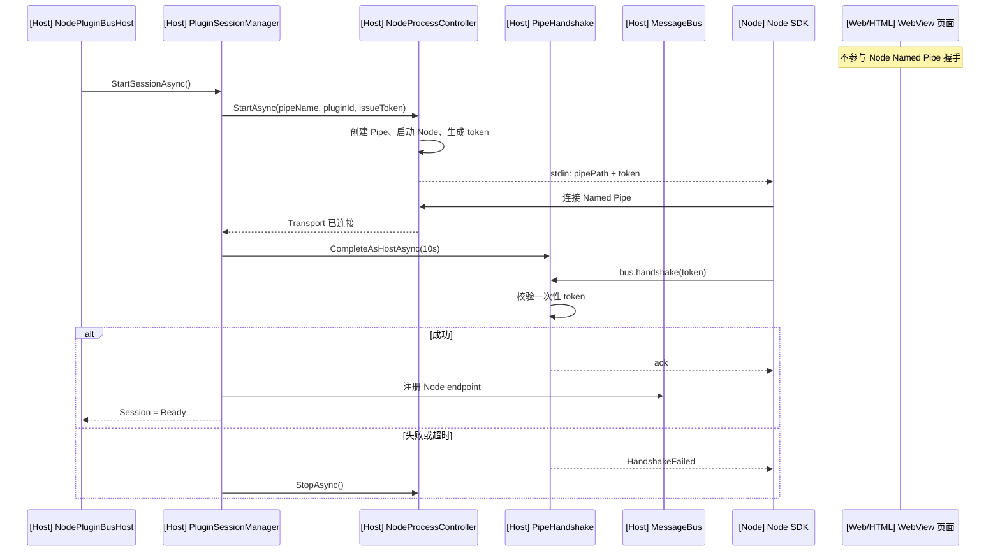
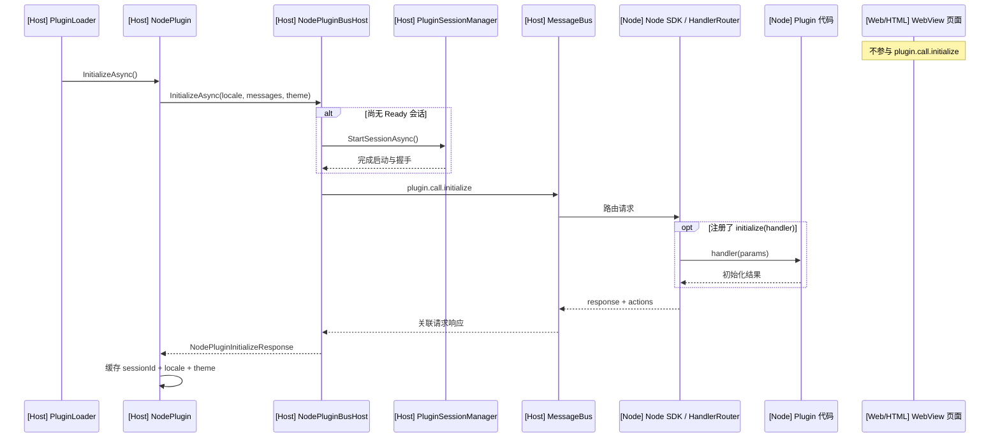
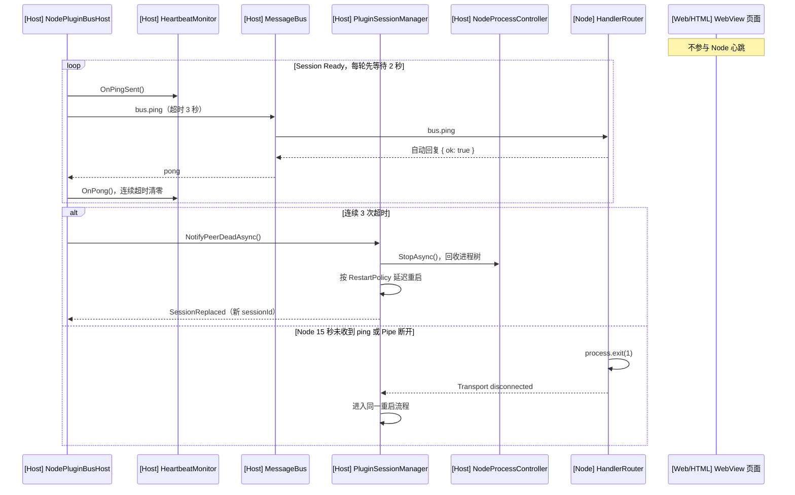

# Node Plugin 初始化、握手与心跳

> 范围：Node 后端与宿主之间的 v3 Named Pipe 通信，不含 WebView2 页面总线。
> 图中 `[Host]` 为 .NET 宿主进程，`[Node]` 为插件 Node 进程；`[Web/HTML]` 有独立的 WebView2 总线，不参与本文三条流程。

## 结论

| 流程 | 是否存在 | 协议/参数 |
|---|---|---|
| 握手 | 是 | `bus.handshake`；超时 10 秒 |
| 初始化 | 是 | `plugin.call.initialize`；业务调用超时默认 30 秒 |
| 心跳 | 是 | `bus.ping`；间隔 2 秒，单次超时 3 秒，连续 3 次判死 |

总体顺序：

`加载插件 → 启动 Node/连接管道 → 握手 → Session Ready → 初始化 → 心跳与业务调用`

## 1. 握手

1. 宿主创建 Named Pipe、启动 Node，并通过 stdin 发送：`<pipePath>\t<一次性 token>`。
2. Node 连接管道，发送只携带 token 的 `bus.handshake`。
3. 宿主校验 token 是否未过期、未使用且属于当前进程；协议版本已在启动前通过 `plugin.json` 校验。
4. 成功后宿主返回无 payload 的确认，在宿主侧把 transport 绑定到 `pluginId`、`sessionId`、`endpointId`，注册总线端点并将会话置为 `Ready`。Node 发出的身份字段不受信任，进入总线前由宿主按 transport 绑定值统一盖章。

会话状态为：`Created → Starting → Handshaking → Ready`。token 有效期 30 秒且只能使用一次；失败或超时会停止该 Node 进程。

## 2. 初始化

- `PluginLoader` 加载插件后在后台调用 `NodePlugin.InitializeAsync()`；搜索和详情页使用前也会再次确保初始化。
- 若会话尚未启动，首次发送初始化请求会先完成上面的启动与握手。
- 宿主通过 `plugin.call.initialize` 发送当前语言、回退语言、翻译消息和主题。
- Node SDK 调用插件注册的 `initialize(handler)`；即使没有 handler，也会返回已注册的 actions。
- 宿主保存 action 定义，并按 `sessionId + locale + theme` 跳过重复初始化。任一项变化时重新初始化。

## 3. 心跳与恢复

- 会话启动后，宿主循环发送 `bus.ping`；Node 路由器自动回复 `{ ok: true }`。
- 任意成功回复会清零连续超时计数；连续 3 次超时后，宿主按“连接断开”处理并尝试重启会话。
- Node 侧还有被动看门狗：15 秒未收到宿主 ping，或管道断开时，进程以错误码退出，避免孤儿进程。
- 自动重启会创建新的 pipe、token 和 `sessionId`；旧请求失败。重启采用指数退避，并限制 5 分钟内最多 2 次；新会话下次使用时会重新初始化。

## 已识别问题

### 高优先级

1. **心跳未与 Session 绑定**：心跳由 `NodePluginBusHost` 启动并跨 Session 读取可变字段；自动重启时可能永久停止，也可能把旧超时计数带入新 Session。详细方案见 [Node Plugin 心跳生命周期重构设计](node-plugin-heartbeat-design.md)。
2. **重启失败可能留下假启动状态**：自动重启开始后 `_started` 仍为 `1`；若新 Session 启动失败，BusHost 可能继续持有旧 Session，后续调用也不会重新启动。
3. **缺少整体启动超时**：10 秒握手超时只覆盖 Pipe 已连接后的握手；Node 若一直不连接 Pipe，启动可以无限等待。

### 中优先级

5. **`Ready` 不等于业务可用**：Session 在握手后即为 `Ready`，插件的 `plugin.call.initialize` 尚未完成；自动重启后也不会立即重新初始化。
6. **初始化缓存存在竞态**：初始化完成后读取当前 `sessionId / locale / theme` 写入缓存，可能把旧响应记到新会话或新语言上。
7. **心跳与业务请求共用通道**：业务背压或异常响应可能终止未受监管的心跳任务。

### 其他改进

8. `EnvelopeValidator` 和路由规则尚未接入生产消息入口。
9. 启动失败且未进入握手时，已签发 token 不会被主动撤销。
10. `PluginLoader` 会并发初始化所有启用插件，插件较多时可能同时拉起大量 Node 进程。

## 关键实现

- 宿主启动与握手：`MyTools.Host.Core/Sessions/PluginSessionManager.cs`、`PipeHandshake.cs`
- Node 启动契约：`MyTools.Host.Transports/Process/NodeProcessController.cs`
- 初始化与心跳：`MyTools.Plugins/NodePlugins/NodePlugin.cs`、`NodePluginBusHost.cs`
- Node SDK：`MyTools.Plugins/Examples/sdk-v3/src/bootstrap.ts`、`router.ts`、`node.ts`
