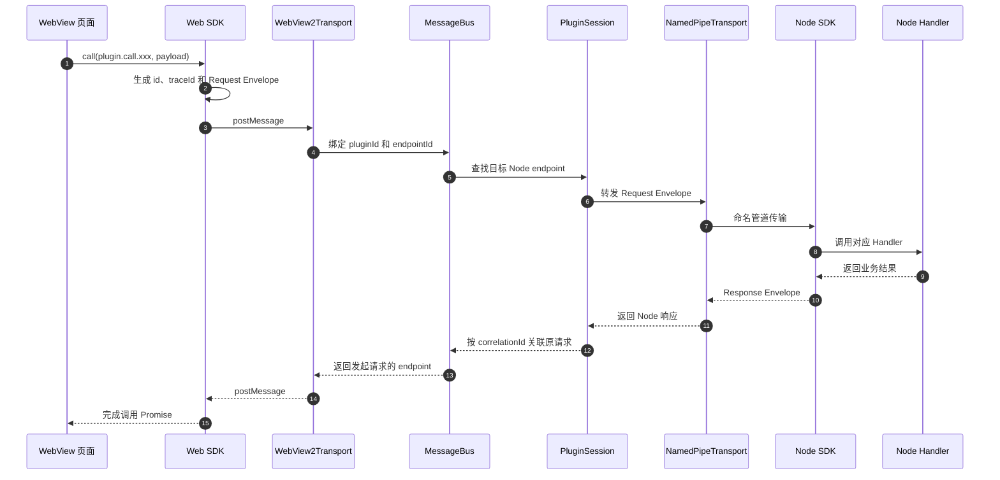
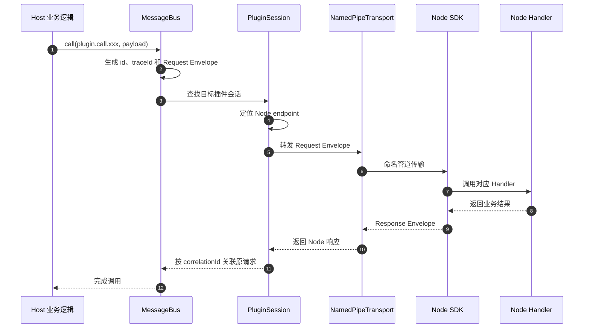
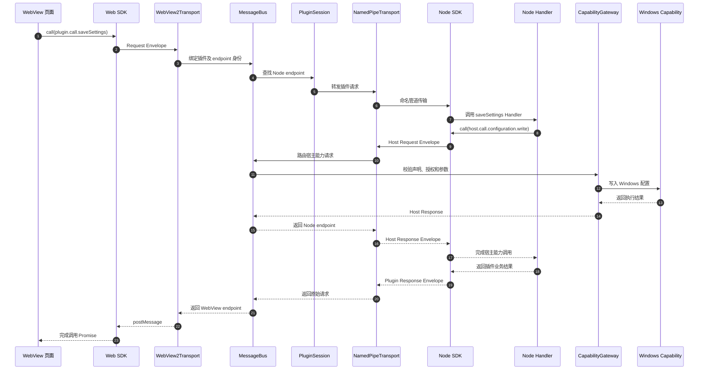
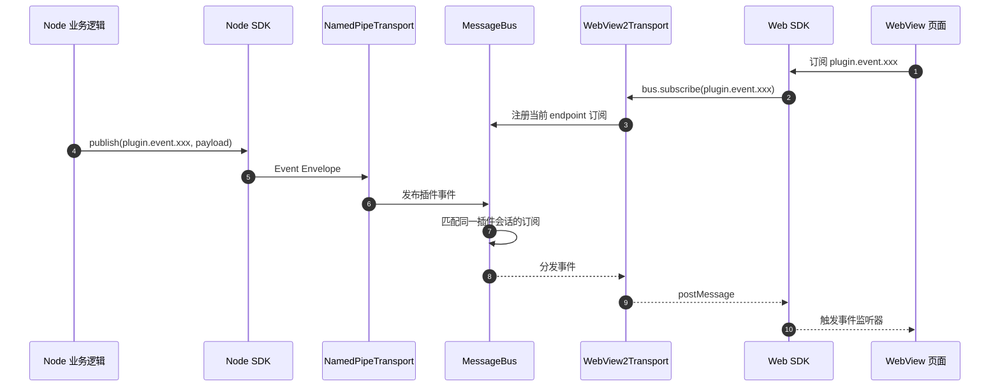

# 插件宿主中央消息总线设计

## 背景

当前 Node 插件由 WPF 宿主启动。宿主与 Node 通过 stdin/stdout 上的逐行 JSON-RPC 通信，WebView2 前端再通过 `postMessage` 由具体 WPF 控件转发到 Node。这个模型足以支持现有插件，但协议路由、UI 控件、进程生命周期和宿主能力绑定较紧，难以同时支持不可信第三方插件、自动恢复、多进程插件和独立诊断工具。

本设计允许直接升级现有插件协议，不要求兼容当前 `plugin.json` 和 `@qping/plugin-common` API。协议保持跨平台，首个实现仅支持 Windows。

## 目标

1. 将插件通信和生命周期从具体 WPF 控件中移出。
2. 为 WebView、Node Worker、宿主能力和诊断工具提供统一消息模型。
3. 将所有插件协议输入视为不可信，仅授予声明且获批的宿主能力。
4. 支持断线检测、自动重启、transport 重建和多个插件 Worker。
5. 使协议与平台无关，Windows 首先使用命名管道实现。
6. 保持组件边界清晰，允许独立测试协议、路由、权限和 transport。

## 非目标

1. 本阶段不实现 macOS 或 Linux 宿主。
2. 不允许 WebView 直接连接 Node 或直接访问系统能力。
3. 不提供任意插件间通信；跨插件通信必须通过显式宿主能力。
4. 不保证兼容旧版插件协议和 SDK。
5. 本阶段不使用 AppContainer 或受限令牌隔离插件进程；操作系统级沙箱单独设计。
6. v3 不传输二进制帧，也不提供流式传输；截图、剪贴板图片和大文件内容通过后续独立旁路通道传递，不进入本期 envelope。

## 方案选择

采用“宿主中央消息总线 + 插件会话 + capability 网关”。

未选择继续增强 stdio，是因为 stdio 与具体子进程生命周期绑定，不利于多 endpoint、多个 Worker 和外部诊断。未选择 Node WebSocket 服务，是因为端口、Origin、认证和不可信页面隔离会增加安全面，并削弱宿主的统一控制。

## 模块边界

### MyTools.Protocol

包含可序列化的纯协议类型：

- 消息 envelope、请求、响应和事件
- 协议版本与握手模型
- 标准错误码
- capability 标识和授权结果
- 插件状态与诊断模型
- 版本化 JSON Schema，以及由 Schema 生成 C# DTO/校验器和 TypeScript 类型/客户端校验器的构建入口

该模块不依赖 WPF、Windows API、Node 或宿主容器。

### MyTools.Host.Core

包含与 UI 和平台无关的宿主核心：

- `MessageBus`：endpoint 注册、请求路由、响应关联和事件订阅
- `PluginSessionManager`：创建、查找、停止和恢复插件会话
- `PluginSession`：插件身份、连接、进程树、授权和健康状态
- session actor：串行化状态转换、endpoint 增删和重启决策
- `CapabilityGateway`：声明校验、授权决策、参数校验和能力调用
- 超时、消息大小、重启策略及诊断事件

### MyTools.Host.Transports

定义统一的 `IMessageTransport`，负责连接、收发帧和断线通知，不承担业务路由。

首批实现：

- `NamedPipeTransport`：WPF 宿主与 Node 进程
- `WebView2Transport`：宿主与插件 WebView

未来可增加 Unix Domain Socket，而无需修改消息总线和插件协议。

### MyTools.Host.Windows

实现 Windows capability，例如配置、剪贴板、热键、手势、窗口、Shell 和通知。实现类型不直接暴露给插件。

### Node SDK

负责命名管道连接、握手、协议编解码、请求处理、事件发布和心跳。SDK 使用协议包生成的类型和客户端校验器，在发送前报告结构化 `InvalidPayload`；该校验只改善开发体验，不能替代宿主校验。管道断开后 SDK 取消 handler 并退出进程，由宿主创建新会话；插件业务只注册 handler，不直接操作 transport。

### Web SDK

负责通过 WebView2 transport 调用消息总线、订阅事件和处理响应。Web SDK 使用同一协议 Schema 生成的类型和客户端校验器，不感知 Node 的进程、管道或重启细节。

## 插件会话模型

插件包 ID 与 entry ID 是两个独立概念。例如 `settings` 是插件包 ID，`main` 是该包中的 entry ID。每个 manifest entry 对应一个 `PluginSession`。会话包含：

- 稳定的插件 ID、entry ID 和本次运行的 session ID
- manifest 声明及已批准 capability
- 一个主 Node endpoint 和零个或多个 Worker endpoint
- 零个或多个 WebView endpoint
- 进程树、连接状态、健康信息和重启计数

窗口只是 WebView endpoint，不拥有 Node 生命周期。关闭窗口仅注销对应 endpoint；停止插件、重新加载插件或退出宿主时才停止会话。

状态机为：

```text
Created -> Starting -> Handshaking -> Ready <-> Degraded
              |             |         |           |
              +-------------+---------+-----------+-> Restarting -> Starting
                                                    |
                                                    v
                                                  Stopped

Created / Starting / Handshaking / Ready / Degraded / Restarting
    -> Stopping -> Stopped
```

- `Degraded` 仅表示主 Node endpoint 仍可服务，但非关键 Worker 或健康检查异常。WebView 正常关闭不导致降级。
- 主 Node 断线、崩溃或用户主动 reload 进入 `Restarting`；宿主终止旧进程树并创建全新会话。
- 启动或握手失败按重启策略进入 `Restarting`；不可恢复错误或超过重启次数上限进入 `Stopped`。
- `Stopping` 表示已停止接收新请求，正在等待优雅关闭或终止进程树。
- 超过重启次数上限后必须由用户或宿主策略重新启动。

每个逻辑 entry 拥有一个串行 session actor。状态转换、endpoint 注册或注销、重启计数和当前 session 快照只能在 actor 队列中修改。actor 不能在处理消息时等待 transport、进程或 capability I/O；它先发起异步操作，操作完成后再把结果投递回队列。

每次创建新的运行尝试、进入 `Starting` 前递增内部 `generation`，并生成新的 `sessionId`。所有异步回调都捕获发起时的 generation；回到 actor 后若 generation 已变化，则直接丢弃结果并记录诊断，防止旧进程的退出、握手或健康检查回调修改新会话。外部旧帧由 `sessionId` 拒绝，内部旧回调由 generation 拒绝。

## 统一消息协议

所有 transport 使用同一 envelope：

```json
{
  "version": "3.0",
  "id": "01J...",
  "correlationId": null,
  "traceId": "01J...",
  "sessionId": "01J...",
  "pluginId": "settings",
  "entryId": "main",
  "endpointId": "node-main",
  "kind": "request",
  "route": "plugin.call.saveConfiguration",
  "timeoutMs": 30000,
  "payload": {},
  "error": null
}
```

字段规则：

- `version`：该连接握手后协商出的协议主次版本
- `id`：本消息的全局唯一 ID
- `correlationId`：响应指向原请求 ID；`bus.cancel` 指向要取消的请求 ID；其他消息为 `null`
- `traceId`：根请求 ID；嵌套调用沿用同一 trace，独立事件使用自身 ID
- `sessionId`：本次 entry 运行的会话身份
- `pluginId`：插件包身份
- `entryId`：插件包内的 entry 身份
- `endpointId`：会话内连接身份
- `kind`：`request`、`response` 或 `event`
- `route`：受约束的路由名
- `timeoutMs`：请求剩余的端到端时间预算；响应和事件为 `null`
- `payload`：路由对应的结构化数据
- `error`：失败响应的标准错误对象，其他消息为 `null`

除握手前的 `bus.handshake` 外，宿主不信任入站 envelope 声明的 `pluginId`、`entryId`、`sessionId` 或 `endpointId`。transport 必须用已认证 endpoint 的绑定值生成规范化消息后再交给总线。会话不匹配的消息直接丢弃并记录安全诊断，不能参与响应关联或路由。

每条转发链路使用单调时钟扣减 `timeoutMs`，下游预算耗尽时返回 `RequestTimeout` 并尽力取消仍在执行的工作。预算传播只能缩小超时与副作用之间的竞态，不能撤销已经提交的外部副作用。副作用 capability 必须在提交前再次检查预算；超时后的结果可能未知，调用方不得自动重试。需要更强保证的路由必须单独定义幂等键或结果查询。

命名管道采用 4 字节小端无符号长度前缀加 UTF-8 JSON 帧。`MaxFrameBytes` 默认为 4 MiB，路由可以设置更低但不能设置更高的上限。接收端必须先读取并校验长度，再分配或租用完整缓冲区；零长度、超限、截断或非法 JSON 均视为非法帧。WebView2 transport 使用相同 envelope，但由 WebView2 提供消息边界。v3 只支持 JSON，不预留 `encoding` 字段或二进制帧类型，也不把大块二进制自动转为 base64 规避限制；超过路由上限的内容返回 `MessageTooLarge`。旁路和流式传输不属于 v3。

握手必须协商出连接使用的唯一版本。主版本不一致时返回 `ProtocolMismatch`；主版本一致时选择双方共同支持的最高次版本，没有共同次版本则握手失败。已协商连接忽略 envelope 和 payload 中未知的可选字段，未知 route 返回 `RouteNotFound`，缺少必填字段返回 `InvalidPayload`。

协议交付语义为 at-most-once：不重放、不持久化队列、不在断线或重启后自动重试。连接断开时所有未完成请求失败，调用方只有在业务路由明确幂等时才能主动重试。

## 路由规则

- `plugin.call.*`：WebView 或宿主调用插件 Node handler
- `host.call.*`：Node 调用受控宿主 capability
- `plugin.event.*`：插件发布的业务事件
- `host.event.*`：语言、主题、查询和生命周期等宿主事件
- `bus.handshake`：连接建立前唯一允许的请求
- `bus.cancel`：尽力取消 `correlationId` 指向的请求
- `bus.subscribe`、`bus.unsubscribe`：管理当前 endpoint 的事件订阅
- `bus.ping`、`bus.pong`：宿主发起的应用层心跳请求和 Node 响应
- `diagnostics.*`：只读诊断接口

消息总线按 `pluginId + entryId + sessionId + route/topic` 隔离。默认禁止跨插件路由。响应只返回发起请求的 endpoint；事件只发给同一插件会话中已订阅的 endpoint。

WebView endpoint 只能调用 `plugin.call.*` 和允许的 `bus.*` 控制路由，并订阅 `plugin.event.*` 或 `host.event.*`；WebView 发起 `host.call.*` 必须返回 `CapabilityDenied`。订阅只存在于当前 endpoint 连接中，宿主不跨连接持久化。SDK 在 transport 重建后重放订阅。状态型 `host.event.*` 路由在订阅成功后立即发送当前快照；重启窗口内的事件不排队，恢复后发送 `host.event.session.restarted`，由订阅方重新读取状态。

`bus.cancel` 是尽力而为语义。请求超时、WebView 关闭或用户取消时，总线向仍在运行的下游发送取消；Node SDK 将其映射为 handler 的 `AbortSignal`。取消可能与正常完成竞态，已完成或无法中断的操作不回滚。

## 核心数据流

跳数只计算跨运行时或 transport 边界；同一 WPF 进程内的 WebView2Transport、MessageBus、PluginSession 和 CapabilityGateway 调用不增加跳数。支持的链路为：

| 情景 | 边界 | 跳数 |
| --- | --- | ---: |
| 页面调用插件逻辑 | WebView → WPF → Node | 2 |
| 宿主调用插件逻辑 | WPF → Node | 1 |
| 插件调用宿主能力 | Node → WPF | 1 |
| 宿主事件推送页面 | WPF → WebView | 1 |
| 插件事件推送页面 | Node → WPF → WebView | 2 |

页面直接调用宿主能力不是支持的链路；WebView 必须先调用插件 Node handler，再由 Node 调用宿主能力，因此完整业务链为 3 个前向边界：WebView → WPF → Node → WPF。响应沿相反方向返回。

### WebView 调用 Node



具体 WPF 控件只负责托管 WebView2Transport，不解析插件业务 action。


### 宿主host调用node


### Node 调用宿主能力

当 WebView 发起的插件业务调用需要继续访问系统能力时，流程如下：



### Node 发布事件




## 权限与安全

### 威胁模型

所有来自 Node、Worker、WebView 和诊断连接的协议输入都视为不可信，必须做身份、路由、大小和 DTO 校验。但 v3 Node 插件进程以当前 Windows 用户权限运行，可以直接访问该用户可访问的文件、网络和系统 API。因此 capability 网关提供的是统一 API、知情同意、最小授权和审计，不是抵御恶意插件代码的操作系统安全边界。

用户只能安装可信来源的插件。AppContainer、受限令牌、文件系统隔离和网络隔离属于后续独立沙箱设计。Job Object 用于进程树回收以及 CPU、内存和子进程数量上限，但不能被描述为安全沙箱。

### Node 与命名管道

1. 宿主生成随机管道名和短时一次性启动令牌。
2. 宿主必须先使用 `PipeOptions.FirstPipeInstance`、当前用户 ACL 和必要系统主体 ACL 创建服务端，再启动 Node 子进程，防止管道名抢占。
3. 启动令牌通过 Node stdin 的 bootstrap 首行传递，不通过命令行参数或环境变量传递；令牌握手成功后立即作废，并设置短过期时间。
4. 握手验证协议版本、令牌、插件 ID、entry ID、预期 PID 和进程创建时间。Windows 实现还应持有预期进程句柄，避免仅依赖可复用 PID。
5. 当前用户 ACL 不能阻止同一用户的其他进程连接，真实防护依赖一次性令牌、预期进程校验和先建管道。
6. stdout/stderr 只承载日志，不承载协议或令牌。

### WebView

1. `WebView2Transport` 创建时固定绑定插件、entry、session 和 endpoint 身份，页面不能声明或切换身份。
2. 插件页面通过每插件虚拟本地域加载。宿主阻止任意外部顶层导航、新窗口和不符合资源策略的请求，并要求插件页面使用受宿主校验的 CSP。
3. WebView 禁止调用 `host.call.*`，系统能力必须经 `plugin.call.*` 到 Node，再由 Node 调用 capability 网关。
4. 页面消息仍按不可信输入处理；XSS 会获得该插件 WebView 被允许的业务调用能力，因此 Node handler 仍需验证业务参数和调用上下文。

### Worker 与 capability 授权

1. Worker 只能由主 Node 通过 `host.call.worker.spawn` 请求宿主创建。宿主为 Worker 分配独立进程、管道、一次性令牌、endpoint ID 和最小 capability 子集。
2. Node 自行 fork 的进程可以作为插件内部实现存在，但不能注册为消息总线 endpoint。
3. manifest 必须按 entry 声明所需 capability，例如 `clipboard.read`、`configuration.write`。用户授权按插件包 ID、发布者签名身份和安装来源绑定；运行时只授予当前 entry 声明且获批的子集。
4. capability 声明扩张、发布者身份变化或安装来源变化必须重新征求同意。未签名的本地开发插件使用独立开发身份，不继承已发布插件授权。
5. capability 元数据定义持久、每会话或每次调用授权，以及调用速率限制。用户可以在宿主设置中查看并撤销授权。
6. 每次调用都由 `CapabilityGateway` 校验 endpoint 身份、manifest 声明、用户授权、速率限制和路由级 DTO，不因同一进程已通过握手而跳过。
7. 禁止把宿主内部对象、原始进程句柄或任意命令执行接口暴露给插件。

### 诊断连接

诊断工具使用独立命名管道，不复用插件总线管道。诊断进程必须由宿主启动或显式批准，并使用宿主通过 bootstrap 通道签发的短时一次性令牌完成握手。诊断 endpoint 默认只读取状态、时延、计数和脱敏错误摘要，不读取业务 payload、凭据或敏感数据。

## 故障处理

- 启动、握手、请求和应用层心跳分别配置超时。
- 每个协议帧和各路由 payload 设置大小上限。
- 非法帧只关闭对应连接并记录诊断，不终止消息总线。
- 主 Node transport 断线后，所有未完成请求返回 `TransportDisconnected`。宿主终止整个 Job Object 进程树并进入 `Restarting`，不允许旧进程使用 resume token 重连。
- Starting、Handshaking、Restarting、Stopping 和 Stopped 期间的新请求返回 `PluginUnavailable`，不静默排队。
- 插件异常退出采用带抖动的指数退避，并设置时间窗口内的最大重启次数。
- 每次重启使用新的管道名、令牌、session ID 和 endpoint ID。
- Node stdout/stderr 不承载协议，完全作为日志流采集，并附加插件和进程身份。
- 宿主退出时先停止接受请求，再通知会话关闭，最后在超时后终止残留进程树。

### 心跳

命名管道连接使用 Host 主动、Node 响应的应用层心跳，不依赖管道断开作为唯一活性信号：

1. Host 周期性发送 `bus.ping` request；ping 使用普通 envelope `id`，并走保留的 control 通道。
2. Node SDK 立即返回 `bus.pong` response，`correlationId` 指向 ping id，`traceId` 与 ping 相同。
3. Host 使用发送和收到 pong 的单调时钟计算 RTT。连续心跳超时达到阈值时，将连接视为假死并按主 Node 断线流程重启。
4. Node SDK 维护未收到 ping 的看门狗；超过宿主失联阈值后取消 handler 并退出，避免宿主假死时插件进程长期残留。
5. Node 不主动发起第二套 ping，避免双心跳状态和超时竞态。

### 背压与并发

消息方向与消息类型正交。Host → Node 和 Node → Host 两个方向都可能承载 request、response、event 和 control，不能按方向推断处理优先级。每个 Node endpoint 在每个方向都使用三类独立、有界的逻辑通道。Host → Node 的出站通道最终由该连接的单写者按优先级写入 transport；Node → Host 的入站消息由读循环分类后按相同优先级调度：

1. **control/response 通道**：承载 ping/pong、取消和与现有 pending request 匹配的响应。其保留容量至少覆盖允许的最大 pending request 数。未知 `correlationId` 的响应直接丢弃并记录。匹配响应不能因事件拥塞被丢弃；若对端长期不读取导致保留通道也耗尽，则关闭连接并让 pending request 以 `TransportDisconnected` 失败，不能扩展为无界队列。
2. **request 通道**：Host 发出的 `plugin.call.*` 与 Node 发出的 `host.call.*` 分别限制 in-flight 和待处理数量。默认每 endpoint 每方向最多 64 个 in-flight request，可由 Host Core 下调。计数在路由接受请求时增加，在响应、取消、超时或断线时减少；超限请求不进入 transport 或 handler 队列，直接返回 `TooManyRequests`。
3. **event 通道**：承载 `plugin.event.*` 和 `host.event.*`。事件路由必须声明丢弃最新、丢弃最旧或按 key 合并的溢出策略。所有丢弃和合并都增加 `droppedEvents` 或 `coalescedEvents` 诊断计数，不向发布方伪装为可靠投递。

读循环必须先校验长度前缀，拒绝超限帧后才能分配或租用缓冲区。合法帧解析后再进入对应的有界通道：入站 `host.call.*` 请求队列满时返回 `TooManyRequests`，入站事件队列满时按路由策略处理，匹配响应进入保留通道。长度前缀超过全局 `MaxFrameBytes` 时不能继续读取 payload 或构造响应，必须直接关闭连接；帧在全局上限内但超过路由 payload 上限时，返回 `MessageTooLarge` 后关闭连接。截断、非法 JSON 或非法 envelope 同样关闭连接并记录诊断。

除各通道消息数上限外，每个 endpoint 还限制队列总字节数，任何队列都不能无界增长。总线和 transport 全异步执行，不在锁或 session actor 内 `await`。每个连接使用单写者保证帧顺序。
- `WebView2Transport` 的发送操作调度到对应 UI Dispatcher。宿主 capability 不得同步阻塞等待插件响应，避免 Node 调用宿主能力时发生重入死锁。

标准错误至少包括：

- `ProtocolMismatch`
- `HandshakeFailed`
- `CapabilityNotDeclared`
- `CapabilityDenied`
- `InvalidPayload`
- `MessageTooLarge`
- `RouteNotFound`
- `RequestTimeout`
- `Cancelled`
- `TooManyRequests`
- `TransportDisconnected`
- `PluginUnavailable`
- `PluginCrashed`
- `InternalError`

错误对象统一包含：

- `code`：稳定的机器可读错误码
- `message`：面向开发者的非敏感摘要
- `retryable`：当前调用是否可能安全重试；默认 `false`
- `details`：路由定义的结构化信息，例如 DTO 校验失败字段；不得包含凭据或完整敏感 payload

## 可观测性

Host Core 记录结构化诊断事件：

- 会话状态变化
- transport 连接和断开
- 请求的 `traceId`、路由、耗时和结果类型
- 心跳 RTT、连续超时次数和假死重启原因
- capability 授权和拒绝
- 插件重启次数及退出码
- 丢弃的超大或非法消息
- 背压拒绝、事件丢弃和合并计数
- 握手失败原因分类，不记录启动令牌

默认日志不记录完整业务 payload。诊断工具通过受限 endpoint 读取会话快照和聚合指标。

## 测试策略

### 单元测试

- envelope 和长度前缀帧的编解码
- 帧解码器 fuzz：零长度、超大长度、截断、分片、粘包和非法 JSON
- 协议版本与握手校验
- 请求响应关联、trace、预算传播和尽力取消
- topic 订阅、快照、重放和插件隔离
- capability 声明、授权和参数校验
- 会话状态转换和重启上限
- session actor 串行化和旧 generation 回调丢弃
- 每 endpoint 三类通道、双向 in-flight、响应保留容量和事件溢出策略
- ping/pong 关联、RTT 和双方看门狗超时
- JSON Schema 生成产物和运行时校验一致性

### 组件测试

使用内存 fake transport 验证消息总线、多个 endpoint、断线、乱序响应、旧 session 迟到消息和取消竞态。使用 fake process controller 验证启动失败、握手失败、崩溃、主动 reload、进程树终止和退避重启。

### 集成测试

使用真实测试 Node 插件验证命名管道握手、双向调用、事件、超大消息拒绝、进程崩溃和自动重启。安全用例覆盖管道名抢占、令牌重放、伪造 plugin/entry/session 身份、跨插件路由、WebView 冒充其他插件和未经授权的诊断连接。

长稳与压力测试覆盖事件洪水下的内存上限和丢弃行为、慢 WebView、反复崩溃重启后的句柄泄漏，以及多个 Worker 并发调用。混沌测试注入响应乱序、帧分片、连接中断和重启期间的旧 session 响应。

CI 从版本化 JSON Schema 重新生成 C# DTO/校验器和 TypeScript 类型/客户端校验器，并要求工作区无 diff。客户端校验失败用例验证 SDK 能提前报告 `InvalidPayload`；绕过或篡改 SDK 的用例验证 CapabilityGateway 仍会独立拒绝非法 payload。

### 端到端测试

覆盖：

```text
WebView -> Node -> host capability -> Node -> WebView
```

并验证未声明与用户拒绝的 capability、Node 重启、窗口关闭后重新打开、订阅恢复、取消和多个 Worker 的行为。

## 实施边界

实施应分阶段完成，但以新协议整体替换旧协议：

1. 建立协议、transport 抽象和 fake transport 测试。
2. 实现消息总线、capability 网关和插件会话状态机。
3. 实现 Windows 命名管道、Node SDK 和进程控制。
4. 将 WebView2 接入统一 transport。
5. 迁移插件 manifest、Node SDK 和示例插件。
6. 删除旧 stdio JSON-RPC 和具体控件中的业务转发代码。
7. 完成安全、故障恢复和端到端验证。

旧协议不会长期并存，避免宿主维护两套权限和生命周期语义。
