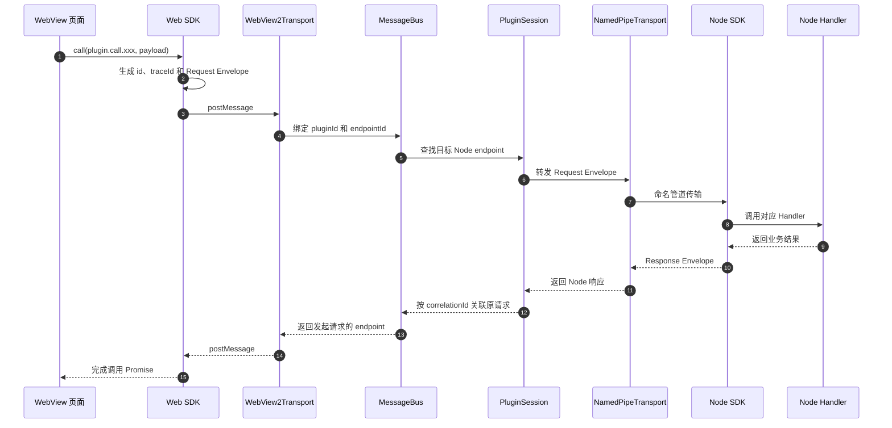
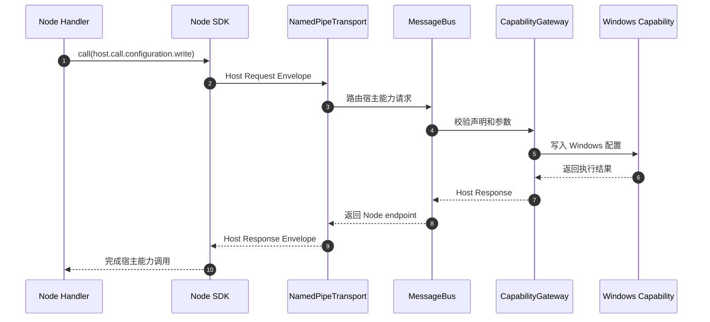

# 插件消息总线 v3 核心设计（第一期）

> 本文档是 v3 设计拆分后的第一期核心部分。范围划分见[总览](2026-08-13-plugin-host-message-bus-design.md)；取消与完整背压见[二期](2026-08-14-plugin-bus-v3-phase2-reliability.md)；第三方插件安全与诊断见[三期](2026-08-14-plugin-bus-v3-phase3-security.md)。

## 背景

当前 Node 插件由 WPF 宿主启动。宿主与 Node 通过 stdin/stdout 上的逐行 JSON-RPC 通信，WebView2 前端再通过 `postMessage` 由具体 WPF 控件转发到 Node。协议路由、UI 控件、进程生命周期和宿主能力绑定较紧，难以支持自动恢复和清晰的组件边界。

## 信任假设

第一期所有插件由本项目作者编写、随宿主分发，视为**可信代码**。协议输入仍做结构校验（防 bug，不防恶意），但不实现面向不可信第三方插件的授权同意、签名身份和速率限制；capability 网关只保留骨架，使架构位置正确、后续可以无重构地加固。envelope、握手和路由命名空间等**协议表面在第一期就冻结**，因为它们事后无法兼容地更改。

## 目标

1. 将插件通信和生命周期从具体 WPF 控件中移出。
2. 为 WebView、Node 和宿主能力提供统一消息模型。
3. 支持断线检测、自动重启和 transport 重建。
4. 使协议与平台无关，Windows 首先使用命名管道实现。
5. 保持组件边界清晰，允许独立测试协议、路由和 transport。
6. 为后续的第三方插件授权和诊断能力预留正确的架构位置。

## 非目标（第一期）

1. 不支持不可信第三方插件；授权同意、发布者签名、速率限制见三期设计。
2. 不实现 `bus.cancel` 取消传播；route 名保留，见二期设计。
3. 不实现事件订阅过滤（`bus.subscribe`）与状态 revision 协议；事件在会话内广播，route 名保留，见二期设计。
4. 不实现独立诊断管道；可观测性依赖结构化日志，见三期设计。
5. 不实现 macOS 或 Linux 宿主。
6. 不允许 WebView 直接连接 Node 或直接访问系统能力。
7. 不提供任意插件间通信；跨插件通信必须通过显式宿主能力。
8. 不保证兼容旧版插件协议和 SDK（`plugin.json`、`@qping/plugin-common`）。
9. 不使用 AppContainer 或受限令牌隔离插件进程。
10. 不传输二进制帧，不提供流式传输；大块内容走后续独立旁路通道。
11. 每个会话只有一个主 Node endpoint，不提供总线级插件 Worker。
12. 不建立 JSON Schema 代码生成管线；第一期协议路由只有十余条，两侧类型手写并以共享样例消息在 CI 中防漂移，路由规模或改动频率增长后再引入代码生成。
13. 不实现 `Degraded` 状态和插件自报健康；当前没有插件使用健康上报，需要时作为纯增量加回。
14. 不设置 Job Object 的 CPU、内存和子进程数量配额；Job Object 只用于进程树回收。资源配额不属于任何一期，失控插件由用户直接停止或卸载。

## 方案选择

采用"宿主中央消息总线 + 插件会话 + capability 网关骨架"。

未选择继续增强 stdio，是因为 stdio 与具体子进程生命周期绑定，不利于多 endpoint 和后续扩展。未选择 Node WebSocket 服务，是因为端口、Origin 和认证会增加安全面，并削弱宿主的统一控制。

## 模块边界

### MyTools.Protocol

包含可序列化的纯协议类型：

- 消息 envelope、请求、响应和事件
- 协议版本与握手模型
- 标准错误码
- capability 标识
- 插件状态模型
- 手写的 C# 协议类型与校验器；本文档是唯一协议来源，TypeScript 侧类型由 SDK 手写对齐，两侧以共享样例消息在 CI 中防漂移（代码生成管线见非目标第 12 条）

该模块不依赖 WPF、Windows API、Node 或宿主容器。

### MyTools.Host.Core

包含与 UI 和平台无关的宿主核心：

- `MessageBus`：endpoint 注册、请求路由、响应关联和事件分发
- `PluginSessionManager`：创建、查找、停止和恢复插件会话
- `PluginSession`：插件身份、连接和进程树状态
- session actor：串行化状态转换、endpoint 增删和重启决策
- `CapabilityGateway`：声明校验、参数校验和能力调用（骨架，见「capability 骨架」）
- 超时、消息大小、重启策略及诊断日志

### MyTools.Host.Transports

定义统一的 `IMessageTransport`，负责连接、收发帧和断线通知，不承担业务路由。

首批实现：

- `NamedPipeTransport`：WPF 宿主与 Node 进程
- `WebView2Transport`：宿主与插件 WebView

未来可增加 Unix Domain Socket，而无需修改消息总线和插件协议。

### MyTools.Host.Windows

实现 Windows capability，例如配置、剪贴板、热键、手势、窗口、Shell 和通知。实现类型不直接暴露给插件。

### Node SDK

负责命名管道连接、握手、协议编解码、请求处理、事件发布和心跳应答。SDK 使用与协议文档手写对齐的 TypeScript 类型和客户端校验，对协议定义的路由在发送前报告结构化 `InvalidPayload`；插件业务路由的 payload 校验由插件自行实现（见「路由规则」）。该校验只改善开发体验，不能替代宿主校验。管道断开后 SDK 取消 handler 并退出进程，由宿主创建新会话；插件业务只注册 handler，不直接操作 transport。

### Web SDK

负责通过 WebView2 transport 调用消息总线、接收事件和处理响应。Web SDK 与 Node SDK 共享同一套手写协议类型和客户端校验，不感知 Node 的进程、管道或重启细节。

## 插件会话模型

插件包 ID 与 entry ID 是两个独立概念。例如 `settings` 是插件包 ID，`main` 是该包中的 entry ID。每个 manifest entry 对应一个 `PluginSession`。会话包含：

- 稳定的插件 ID、entry ID 和本次运行的 session ID
- manifest 声明的 capability
- 一个主 Node endpoint
- 零个或多个 WebView endpoint
- 进程树、连接状态和重启计数

窗口只是 WebView endpoint，不拥有 Node 生命周期。关闭窗口仅注销对应 endpoint；停止插件、重新加载插件或退出宿主时才停止会话。

`sessionId` 标识主 Node 的一次运行，随每次重启更新。承载 WebView 的窗口和控件跨 Node 重启保留，但主 Node 重启时宿主强制重载该 entry 的所有插件页面：旧页面连同其 endpoint 和未完成请求一并作废，新页面重新握手并注册为新会话下的 WebView endpoint。页面状态与 Node 状态因此总是同代，插件不需要实现跨 Node 重启的页面状态恢复逻辑。WebView 出站消息的 `sessionId` 由宿主在规范化时盖上当前值，页面不感知也不提供该字段；命名管道连接与单次运行同生命周期，旧进程的帧由 `sessionId` 拒绝。

状态机为：

```text
Created -> Starting -> Handshaking -> Ready
              |             |           |
              +-------------+-----------+-> Restarting -> Starting
                                          |
                                          v
                                        Stopped

Created / Starting / Handshaking / Ready / Restarting
    -> Stopping -> Stopped
```

- 心跳连续超时不定义中间状态，直接按主 Node 断线流程重启；WebView 正常关闭只注销 endpoint，不影响会话状态。插件自报健康的 `Degraded` 状态推迟到有真实使用者时作为纯增量加回（见非目标第 13 条）。
- 主 Node 断线、崩溃或用户主动 reload 进入 `Restarting`；宿主终止旧进程树并创建全新会话。
- 启动或握手失败按重启策略进入 `Restarting`；不可恢复错误或超过重启次数上限进入 `Stopped`。
- `Stopping` 表示已停止接收新请求，正在等待优雅关闭或终止进程树。
- 超过重启次数上限后必须由用户或宿主策略重新启动。

每个逻辑 entry 拥有一个串行 session actor。状态转换、endpoint 注册或注销、重启计数和当前 session 快照只能在 actor 队列中修改。actor 不能在处理消息时等待 transport、进程或 capability I/O；它先发起异步操作，操作完成后再把结果投递回队列。

每次创建新的运行尝试、进入 `Starting` 前递增内部 `generation`，并生成新的 `sessionId`。所有异步回调都捕获发起时的 generation；回到 actor 后若 generation 已变化，则直接丢弃结果并记录诊断，防止旧进程的退出、握手或健康检查回调修改新会话。外部旧帧由 `sessionId` 拒绝，内部旧回调由 generation 拒绝。

## 统一消息协议

所有 transport 使用同一 envelope。**已有 envelope 字段的名称、类型和语义在第一期冻结**，任何阶段不得删除、改名或变更语义；新增 envelope 字段仅限可选、有默认行为的字段，且必须伴随次版本递增经握手协商，旧端按"忽略未知可选字段"规则兼容：

```json
{
  "version": "3.0",
  "id": "01J...",
  "correlationId": null,
  "traceId": "01J...",
  "sessionId": "01J...",
  "pluginId": "settings",
  "entryId": "main",
  "endpointId": "node-main",
  "kind": "request",
  "route": "plugin.call.saveConfiguration",
  "timeoutMs": 30000,
  "payload": {},
  "error": null
}
```

字段规则：

- `version`：该连接握手后协商出的协议主次版本；握手消息本身填写发送方支持的最高版本
- `id`：本消息的全局唯一 ID
- `correlationId`：响应指向原请求 ID；其他消息为 `null`（二期的 `bus.cancel` 复用此字段）
- `traceId`：根请求 ID；嵌套调用沿用同一 trace，独立事件使用自身 ID
- `sessionId`：本次 entry 运行的会话身份
- `pluginId`：插件包身份
- `entryId`：插件包内的 entry 身份
- `endpointId`：会话内连接身份
- `kind`：`request`、`response` 或 `event`
- `route`：受约束的路由名
- `timeoutMs`：请求的超时时长；响应和事件为 `null`
- `payload`：路由对应的结构化数据
- `error`：失败响应的标准错误对象，其他消息为 `null`

除握手前的 `bus.handshake` 外，宿主不信任入站 envelope 声明的 `pluginId`、`entryId`、`sessionId` 或 `endpointId`。transport 必须用已认证 endpoint 的绑定值生成规范化消息后再交给总线。会话不匹配的消息直接丢弃并记录诊断，不能参与响应关联或路由。入站 `timeoutMs` 由宿主钳制到路由配置的上限，缺失或非法时使用路由默认值；格式非法的 `traceId` 由宿主重新生成。

第一期超时为**每跳独立超时**：每条链路（宿主等待 Node、Node 等待宿主 capability）使用各自路由配置的超时，超时返回 `RequestTimeout`。跨跳的端到端预算扣减与传播见二期设计。超时后下游工作的结果未知，调用方不得自动重试；需要更强保证的路由必须单独定义幂等键或结果查询。

命名管道采用 4 字节小端无符号长度前缀加 UTF-8 JSON 帧。`MaxFrameBytes` 默认为 4 MiB，路由可以设置更低但不能设置更高的上限。WebView2 transport 使用相同 envelope，由 WebView2 提供消息边界。只支持 JSON，不预留 `encoding` 字段或二进制帧类型，也不把大块二进制转为 base64 规避限制；超过路由上限的内容返回 `MessageTooLarge`。

所有 transport 的连接都以 `bus.handshake` 开始：命名管道握手携带一次性令牌并验证进程身份，WebView2 握手仅协商版本，身份由宿主在创建 transport 时绑定。

握手先于版本协商，不能依赖协商结果来解析自身，其格式定义为固定的 bootstrap 契约：

- 握手请求、响应和失败响应只使用一组永久冻结的字段：`version`、`id`、`correlationId`、`kind`、`route`、`payload`、`error`。任何未来版本（包括主版本变更）都不得改变这些字段的名称、类型和语义，只能在 payload 内新增可选字段。
- 握手请求的 `version` 填发起方支持的最高版本，payload 携带其支持的全部主次版本。
- 主版本不一致时返回 `ProtocolMismatch` 并关闭连接；接收方即使不支持对方主版本，也必须能解析 bootstrap 字段并完成该响应。
- 主版本一致时选择双方共同支持的最高次版本；没有共同次版本则握手失败。响应 payload 携带协商结果或双方版本集合以便诊断。
- 已协商连接忽略 envelope 和 payload 中未知的可选字段，未知 route 返回 `RouteNotFound`，缺少必填字段返回 `InvalidPayload`。

协议交付语义为 at-most-once：不重放、不持久化队列、不在断线或重启后自动重试。连接断开时所有未完成请求失败，调用方只有在业务路由明确幂等时才能主动重试。

## 路由规则

- `plugin.call.*`：WebView 或宿主调用插件 Node handler
- `host.call.*`：Node 调用宿主 capability
- `plugin.event.*`：插件发布的业务事件
- `host.event.*`：语言、主题、查询和生命周期等宿主事件
- `bus.handshake`：连接建立前唯一允许的请求
- `bus.ping`：宿主发起的应用层心跳请求；Node 以普通 response 应答，不定义独立的 pong 路由
- 保留 route 名（第一期不实现，收到返回 `RouteNotFound`）：`bus.cancel`、`bus.subscribe`、`bus.unsubscribe`、`diagnostics.*`

协议类型和校验只覆盖 envelope、`bus.*`、`host.call.*`、`host.event.*` 和标准错误对象。`plugin.call.*` 与 `plugin.event.*` 的 payload 对总线不透明：宿主只校验 envelope 结构、路由名合法性和大小上限，不校验插件业务 payload。插件业务 Schema 属于插件内部实现——这些路由的两端都是同一插件自己的代码；插件可自带校验库获得端到端类型安全，SDK 提供校验挂接点但不强制。

消息总线按 `pluginId + entryId + sessionId + route` 隔离。禁止跨插件路由。响应只返回发起请求的 endpoint。

**事件采用会话内广播，第一期没有订阅机制**：`plugin.event.*` 分发给同一会话的所有 WebView endpoint；`host.event.*` 分发给目标会话的所有 endpoint。页面对不关心的事件直接忽略。事件量增长到需要过滤时，再按二期设计追加 `bus.subscribe`，对广播语义向后兼容。

- WebView endpoint 只能调用 `plugin.call.*`；发起 `host.call.*` 必须返回 `CapabilityDenied`。系统能力必须经 `plugin.call.*` 到 Node，再由 Node 调用 capability 网关。
- 主 Node 重启伴随插件页面强制重载，页面按初始化流程重新读取状态，不定义单独的恢复事件；重启窗口内的事件不排队。

## 核心数据流

跳数只计算跨运行时或 transport 边界；同一 WPF 进程内的 WebView2Transport、MessageBus、PluginSession 和 CapabilityGateway 调用不增加跳数。支持的链路为：

| 情景 | 边界 | 跳数 |
| --- | --- | ---: |
| 页面调用插件逻辑 | WebView → WPF → Node | 2 |
| 宿主调用插件逻辑 | WPF → Node | 1 |
| 插件调用宿主能力 | Node → WPF | 1 |
| 宿主事件推送页面 | WPF → WebView | 1 |
| 插件事件推送页面 | Node → WPF → WebView | 2 |

页面直接调用宿主能力不是支持的链路（见路由规则），因此完整业务链为 3 个前向边界：WebView → WPF → Node → WPF。响应沿相反方向返回。

### WebView 调用 Node



具体 WPF 控件只负责托管 WebView2Transport，不解析插件业务 action。

宿主调用 Node 与上图的后半段相同，区别仅在请求由 Host 业务逻辑直接进入 MessageBus，envelope 由总线生成。

### Node 调用宿主能力

WebView 发起的插件业务调用到达 Node handler 后（前半段同上图），handler 继续访问系统能力：



宿主能力调用完成后，Node handler 照常返回插件业务结果，沿上图的响应路径回到 WebView。

事件发布是同一模型的单向版本：Node SDK 发出 Event Envelope，总线匹配目标会话后广播给该会话的 WebView endpoint。

## capability 骨架

第一期插件可信，capability 网关不做授权决策，但**架构位置和调用路径与最终形态一致**，后续加固不需要移动任何组件：

1. manifest 必须按 entry 声明所需 capability，例如 `clipboard.read`、`configuration.write`。未声明的调用返回 `CapabilityNotDeclared`——即使插件可信也强制声明，保证 manifest 反映真实能力面。
2. 声明即授予：第一期不弹授权确认，不实现按来源和签名的授权绑定。`CapabilityGateway` 中授权决策为一个总是通过的接口点（返回结构化授权结果），三期在此接入真实决策。
3. 每次调用都由 `CapabilityGateway` 校验 endpoint 身份、manifest 声明和路由级 DTO，不因同一进程已通过握手而跳过。
4. 每次 capability 调用记录结构化审计日志（谁、什么路由、结果），为三期的授权 UI 和诊断积累数据形态。
5. 禁止把宿主内部对象、原始进程句柄或任意命令执行接口暴露给插件。

## 安全基线

第一期的安全目标是防 bug 和防意外，不是防恶意插件（插件可信）。但以下机制成本低且事后难以补加，第一期即实现：

### Node 与命名管道

1. 宿主生成随机管道名和短时一次性启动令牌。
2. 宿主必须先使用 `PipeOptions.FirstPipeInstance`、当前用户 ACL 和必要系统主体 ACL 创建服务端，再启动 Node 子进程，防止管道名抢占。
3. 启动令牌通过 Node stdin 的 bootstrap 首行传递，不通过命令行参数或环境变量传递；令牌握手成功后立即作废，并设置短过期时间。
4. 握手验证协议版本、令牌、插件 ID、entry ID、预期 PID 和进程创建时间。Windows 实现还应持有预期进程句柄，避免仅依赖可复用 PID。
5. stdout/stderr 只承载日志，不承载协议或令牌；日志采集时附加插件和进程身份。

### WebView

1. `WebView2Transport` 创建时固定绑定插件、entry 和 endpoint 身份，页面不能声明或切换身份。主 Node 重启时宿主强制重载页面并重建 endpoint 绑定，旧页面及其在途消息一并作废。
2. 插件页面通过每插件虚拟本地域加载。宿主阻止任意外部顶层导航、新窗口和不符合资源策略的请求，并在虚拟域响应中注入基线 CSP。
3. 页面消息按结构校验处理；Node handler 仍需验证业务参数和调用上下文。

## 故障处理

- 启动、握手、请求和应用层心跳分别配置超时。
- 每个协议帧和各路由 payload 设置大小上限。
- 非法帧最多关闭对应连接并记录诊断，不终止消息总线。
- 主 Node transport 断线后，所有未完成请求返回 `TransportDisconnected`。宿主终止整个 Job Object 进程树并进入 `Restarting`，不允许旧进程重连。
- Starting、Handshaking、Restarting、Stopping 和 Stopped 期间的新请求返回 `PluginUnavailable`，不静默排队。
- 插件异常退出采用带抖动的指数退避，并设置时间窗口内的最大重启次数。
- 每次重启使用新的管道名、令牌、session ID 和 Node endpoint ID，并强制重载该 entry 的所有插件页面；承载页面的窗口和控件保留，重载后的页面重新握手并注册为新的 WebView endpoint。
- Job Object 只用于进程树回收，不是安全沙箱；资源配额见非目标第 14 条。
- 宿主退出时先停止接受请求，再通知会话关闭，最后在超时后终止残留进程树。

### 心跳

心跳只有一个方向：Host 周期性发送 `bus.ping`，Node 只应答、不发起自己的 ping。在此之上有两个**被动**计时器（不是两套心跳），分别判定对方假死：

1. Host 周期性发送 `bus.ping` request；Node SDK 立即返回对应 response，`correlationId` 指向 ping id。
2. **Host 侧看门狗**：Host 使用单调时钟计算 RTT，连续心跳超时达到阈值时，将连接视为假死并按主 Node 断线流程重启。不依赖管道断开作为唯一活性信号。
3. **Node 侧看门狗**：Node SDK 本地记录未收到 ping 的时长，超过宿主失联阈值后取消 handler 并退出，不发送任何消息。它兜底的是宿主进程冻结（管道未断、Job 未关）导致 Node 成为永久孤儿的场景；宿主崩溃或正常退出由 Job Object kill-on-close 和管道断开覆盖，不依赖此看门狗。阈值应显著大于 ping 间隔，容忍宿主短暂卡顿。
4. Node 不主动发起第二套 ping：双向独立心跳意味着两套超时参数和可能互相矛盾的假死判定，单向 ping 加对端被动计时覆盖相同故障面且状态只有一份。

### 背压（简化模型）

第一期使用两条简单规则，完整的三通道模型见二期设计：

1. **pending request 上限**：每 endpoint 每方向的未完成请求数有上限（默认 64，可由 Host Core 下调），超限请求不进入 transport 或 handler 队列，直接返回 `TooManyRequests`。响应、超时或断线时释放。ping 及其响应不占用该配额，且优先于普通消息发送，避免请求拥塞导致误判假死。
2. **有界事件队列**：每 endpoint 的出站事件队列有界，满时丢弃最旧并递增 `droppedEvents` 诊断计数，不向发布方伪装为可靠投递。页面重载或重新读取状态即可恢复，事件本就不承诺可靠。

命名管道读循环必须先校验长度前缀，拒绝超限帧后才能分配或租用缓冲区。长度前缀超过全局 `MaxFrameBytes` 时直接关闭连接；帧在全局上限内但超过路由 payload 上限时返回 `MessageTooLarge`，连接保持可用。截断、非法 JSON 或非法 envelope 关闭连接并记录诊断。WebView2 消息在反序列化前先检查字节长度，超全局上限的直接丢弃并记录诊断。

总线和 transport 全异步执行，不在锁或 session actor 内 `await`。每个连接使用单写者保证帧顺序。`WebView2Transport` 的发送操作调度到对应 UI Dispatcher。宿主 capability 不得同步阻塞等待插件响应，避免 Node 调用宿主能力时发生重入死锁。

## 标准错误

第一期使用的错误码：

- `ProtocolMismatch`
- `HandshakeFailed`
- `CapabilityNotDeclared`
- `CapabilityDenied`（第一期仅用于 WebView 越权调用 `host.call.*`）
- `InvalidPayload`
- `MessageTooLarge`
- `RouteNotFound`
- `RequestTimeout`
- `TooManyRequests`
- `TransportDisconnected`
- `PluginUnavailable`
- `InternalError`

保留给后续阶段的错误码（第一期定义但不产生）：`Cancelled`、`RateLimited`。

错误对象统一包含：

- `code`：稳定的机器可读错误码
- `message`：面向开发者的非敏感摘要
- `retryable`：当前调用是否可能安全重试；默认 `false`
- `details`：路由定义的结构化信息，例如 DTO 校验失败字段；不得包含凭据或完整敏感 payload

## 可观测性

第一期不做独立诊断管道，Host Core 记录结构化诊断日志：

- 会话状态变化
- transport 连接和断开
- 请求的 `traceId`、路由、耗时和结果类型
- 心跳 RTT、连续超时次数和假死重启原因
- capability 调用审计
- 插件重启次数及退出码
- 丢弃的超大或非法消息、事件丢弃计数
- 握手失败原因分类，不记录启动令牌

默认日志不记录完整业务 payload。

## 测试策略

### 单元测试

- envelope 和长度前缀帧的编解码
- 帧解码器 fuzz：零长度、超大长度、截断、分片、粘包和非法 JSON
- 协议版本与握手校验，包括不支持的主版本仍能按 bootstrap 契约解析并返回 `ProtocolMismatch`
- 请求响应关联和 trace
- 事件会话内广播和插件隔离
- capability 声明校验和 DTO 校验
- 会话状态转换和重启上限
- session actor 串行化和旧 generation 回调丢弃
- pending 上限与事件队列溢出
- ping/pong 关联、RTT、Host 侧假死判定和 Node 侧失联看门狗超时
- C# 与 TypeScript 两侧手写协议类型对同一组共享样例消息编解码一致（防手写类型漂移）

### 组件测试

使用内存 fake transport 验证消息总线、多个 endpoint、断线、乱序响应和旧 session 迟到消息。使用 fake process controller 验证启动失败、握手失败、崩溃、主动 reload、进程树终止和退避重启。

### 集成测试

使用真实测试 Node 插件验证命名管道握手、双向调用、事件广播、超大消息拒绝、进程崩溃和自动重启。安全用例覆盖管道名抢占、令牌重放、伪造 plugin/entry/session 身份和跨插件路由。

协议样例消息作为共享 fixture 同时喂给 C# 和 TypeScript 编解码测试，在 CI 中暴露手写类型漂移。

### 端到端测试

覆盖：

```text
WebView -> Node -> host capability -> Node -> WebView
```

并验证未声明 capability 的拒绝、Node 重启后页面强制重载、窗口关闭后重新打开的行为。

## 实施步骤

实施分阶段完成，但以新协议整体替换旧协议：

1. 建立协议、transport 抽象和 fake transport 测试。
2. 实现消息总线、capability 网关骨架和插件会话状态机。
3. 实现 Windows 命名管道、Node SDK 和进程控制。
4. 将 WebView2 接入统一 transport。
5. 迁移插件 manifest、Node SDK 和示例插件。
6. 删除旧 stdio JSON-RPC 和具体控件中的业务转发代码。
7. 完成故障恢复和端到端验证。

旧协议不会长期并存，避免宿主维护两套权限和生命周期语义。
